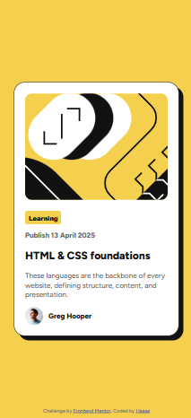
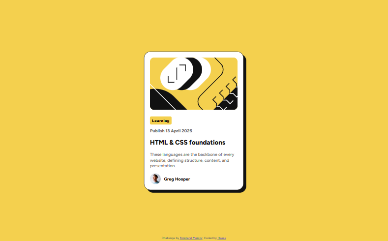

# Frontend Mentor - Blog preview card solution

This is a solution to the [Blog preview card challenge on Frontend Mentor](https://www.frontendmentor.io/challenges/blog-preview-card-ckPaj01IcS). Frontend Mentor challenges help you improve your coding skills by building realistic projects. 

## Table of contents

### Overview

This is my solution for the **Blog Preview Card** challenge on Frontend Mentor. The goal was to build a simple and responsive blog card component based on a provided design.

I implemented hover effects to change the background color and added a subtle `scale` transformation on the avatar to make the UI feel more dynamic. While the layout was straightforward, I spent extra time fine-tuning the responsive spacing, especially padding and text alignment, to make sure it looked good on all screen sizes.

### The Challenge

The challenge was to build a blog preview card that closely matches the provided design. The card needed to be fully responsive and include interactive hover effects.

### Screenshot

### Links

- Live Site URL: [Github Pages](https://github.com/haese-hks/blog-preview-card)

- Solution URL: [Frontend Mentor](https://www.frontendmentor.io/solutions/qr-code-component-IDWP4MLZsB)

### My Process

1. **Design Review**: I began by reviewing the provided design, focusing on the layout and the core components: the image, title, date, and avatar. I made a plan for how to break down the card into sections: header, content, and footer.

2. **HTML Structure**: I structured the content with semantic HTML tags. I used `<main>` for the main content area, `<section>` for the card's content, and `<figure>` for the avatar. I also made sure to include the correct alt text for images and the `<time>` element for the publication date.

3. **Styling with CSS**: I applied styles using Flexbox to create a responsive layout. I made sure to adjust padding and margins for different screen sizes and used `@font-face` to include custom fonts. I also set up a consistent color scheme for text and backgrounds.

4. **Hover Effects & Animations**: The hover effects were important for adding interactivity. I used `transform: scale()` to create a zoom effect on the avatar image, and I added a background color change for certain parts of the card when hovered to improve user engagement.

5. **Responsive Design**: I made sure the card looks great on mobile, tablet, and desktop devices by using media queries. I tweaked padding and text sizes for smaller screens to ensure readability and proper spacing.

6. **Final Tweaks**: After implementing the main features, I tested the layout on different screen sizes, adjusted for accessibility, and ensured the hover effects were smooth. Finally, I double-checked the code for any potential improvements or fixes before finalizing the design.

## Built With

- HTML5
- CSS3
- Flexbox
- `@font-face` for custom fonts
- Media Queries for responsive design
- [GitHub Pages](https://pages.github.com) for deployment

## Useful Resources

- [freeCodeCamp](https://www.freecodecamp.org/): The platform I used to learn HTML, CSS, and JavaScript in depth, including lessons on forms, layouts, and responsiveness.

- [MDN Web Docs - CSS](https://developer.mozilla.org/en-US/docs/Web/CSS): My main resource for learning about CSS properties and techniques, especially Flexbox and Media Queries.

- [W3Schools - CSS](https://www.w3schools.com/css/): A handy reference for quick examples and documentation on CSS usage.

- [Frontend Mentor - Blog Preview Card Challenge](https://www.frontendmentor.io/challenges/blog-preview-card-ryaPa2l8M): The main challenge page that provided the design and requirements for this project.

- [Google Fonts](https://fonts.google.com/): I used Google Fonts to find and implement the `Figtree` font for this project.

- [CSS-Tricks - Transform](https://css-tricks.com/almanac/properties/t/transform/): A great resource for understanding how to use the `transform` property, including `scale()` for the hover effect.

- [GitHub Pages Documentation](https://docs.github.com/en/pages): The guide I used to deploy this project on GitHub Pages and make it publicly accessible online.

### Author

- Frontend Mentor: [@haese-hks](https://www.frontendmentor.io/profile/haese-hks)
- GitHub: [@haese-hks](https://github.com/haese-hks)

## Acknowledgments

- Thanks to [Frontend Mentor](https://www.frontendmentor.io) for providing the challenge and design files.
- Big thanks to the [freeCodeCamp](https://www.freecodecamp.org) community for all the learning resources and tutorials.
- Special thanks to [CSS-Tricks](https://css-tricks.com) for their helpful guides and tutorials on CSS.
- Shout out to the [MDN Web Docs](https://developer.mozilla.org/en-US/docs/Web/CSS) for being an incredible resource for understanding web technologies.
